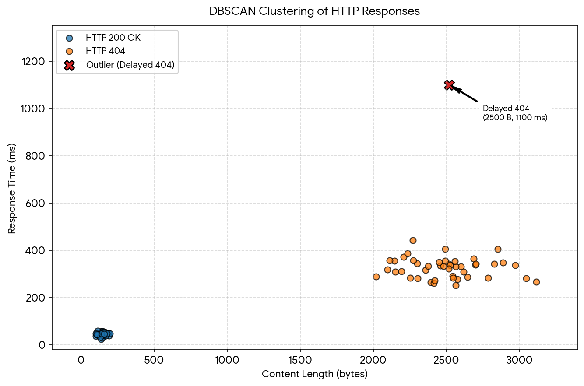

# webfuzzy

A web security testing tool for vulnerability hunting against HTTP endpoints. Webfuzzy bridges automated analysis and manual testing by speeding up outlier-based fuzzing with DBSCAN clustering.

Webfuzzy is still a work-in-progress, and needs a few more features before its fully ready. Currently limited to a single payload position per-run.

Build with `cargo build`. Quick start:

```
cargo run -- --url https://target/api/v1/get?id=§1§
```

Section sign (§) characters can be added to the command line with `ctrl+shift+u a7` on most Linux systems. 

# Usage

```
Web security testing tool for vulnerability hunting against HTTP endpoints

Usage: webfuzzy [OPTIONS] --url <URL>

Options:
  -u, --url <URL>
          Target URL
  -H, --header <HEADERS>
          HTTP headers in format 'Name: Value' (repeatable). Wrap the original value in marker pairs to fuzz it, in the key ('§X-Api§-Key: v') and/or the value ('X-Api-Key: §key§')
  -d, --data <DATA>
          Request body/data (for POST/PUT/etc)
  -X, --request <METHOD>
          HTTP method (GET, POST, PUT, DELETE, etc.) [default: GET]
      --baseline-count <BASELINE_COUNT>
          Number of baseline requests to send [default: 10]
  -w, --wordlist <WORDLIST>
          Fuzzing wordlist file path. Defaults to built-in wordlist
  -o, --output <OUTPUT>
          Output directory for logs [default: .]
      --marker <MARKER>
          Payload span delimiter (default: §). Wrap the original value of a fuzzable parameter in a marker pair, e.g. `?id=§1§`: baseline requests send the original value without markers (`?id=1`) and fuzzing runs replace the whole span (markers and original value) with the payload [default: §]
      --threads <THREADS>
          Number of concurrent requests for fuzzing (lower values improve timing analysis accuracy) [default: 5]
      --timeout <TIMEOUT>
          Request timeout in seconds [default: 30]
      --skip-baseline
          Skip baseline testing
  -v, --verbose
          Verbose output
      --max-clusters <MAX_CLUSTERS>
          Maximum number of clusters to report [default: 6]
      --disable-timing
          Disable timing analysis
  -h, --help
          Print help (see more with '--help')
  -V, --version
          Print version
```

# Architecture

- DBSCAN clustering of response data to classify endpoint behaviour quickly, and find outliers (noise). - Curl argument interop. Arguments are as-close-as-possible to `curl`, so any tool that offers a `copy as curl` function (browsers, testing tools) can easily be pasted into a webfuzzy run
- Sensible defaults, aiming for minimal runtime configuration.
- Auditability. All HTTP requests and responses sent/recieved by webfuzzy are written to a `jsonl` file in the current directory by default. If the user needs to investigate some condition such as a server crash, this log contains all data sent/recieved by the `http_client.rs` HTTP client.

# Clustering

WebFuzzy uses DBSCAN to cluster response data into groups, with the aim of quickly idenfying how an target API or application behaves.

Here is a quick PNG that simplifies the concept with only two features (two dimensions):



The above shows a stable 200 response, a 404 response that has variable content lengths (likely reflecting the input payload), and a timing outlier that warrants further investigation.

Current features used for clustering are:
    - Status Code - applied categorically, clustering is run per-status code since a difference of HTTP/200 and HTTP/201 is a very meaningful difference for an API. Euclidian distance between response data points for HTTP/200 and HTTP/201, for example, shouldn't be clustered together.
    - Response content length in bytes.
    - Time-to-first byte timing data.
    - Response content word count.
    - Response content line count.

# License

Webfuzzy is released under BSD 3-Clause. See [LICENSE](https://github.com/denandz/webfuzzy/blob/main/LICENSE).
